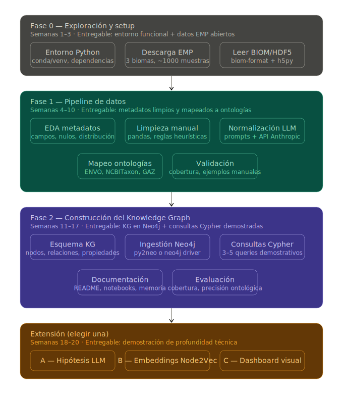

# Plan de trabajo realista para EMPKG-lite

El proyecto tiene tres capas de complejidad creciente, y el riesgo principal de un TFG es intentar construir las tres al mismo tiempo. El plan que sigue prioriza construir una capa sólida antes de pasar a la siguiente.

## Diagrama
<p align="center">
  
</p>

### Fase 0
Tener el entorno listo y poder abrir un fichero BIOM antes de diseñar nada.

**Tareas:**
1.   Crear entorno Python (conda recomendado para bioinformática por compatibilidad con ```biom-format``` y ```h5py```).
2.   Instalar dependencias básicas: ```biom-format```, ```h5py```, ```pandas```, ```numpy```.
3.   Descargar un subconjunto pequeño del EMP (un subconjunto pequeño de EMP Release 1, por ejemplo ```subset_2k```).
4.   Abrir el fichero BIOM programáticamente, inspeccionar su estructura (IDs de muestras, IDs de OTUs/ASVs, tabla de abundancias, metadatos).
5.   Ir actualizando los apuntes.

El objetivo es entender la estructura de los ficheros BIOM. Tener un notebook ```explore_biom_data.ipynb```; que abra el fichero, muestre las primeras filas de la tabla de abundancias y liste las columnas de metadatos disponibles.