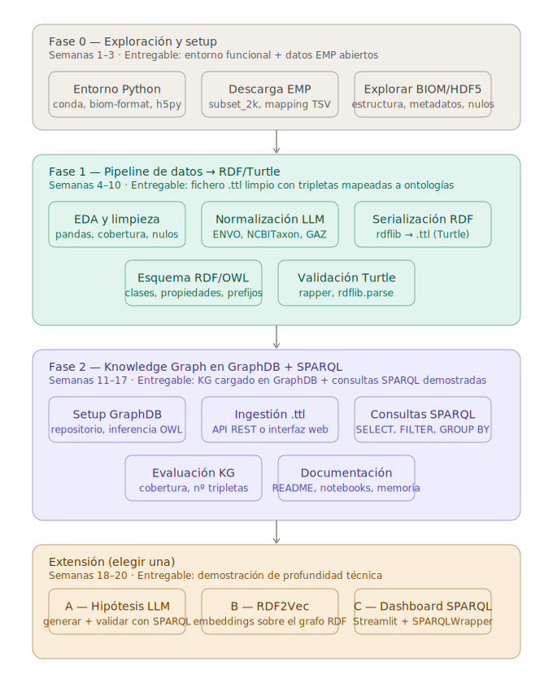

# Plan de trabajo realista para EMPKG-lite

El proyecto tiene tres capas de complejidad creciente, y el riesgo principal de un TFG es intentar construir las tres al mismo tiempo. El plan que sigue prioriza construir una capa sólida antes de pasar a la siguiente.

## Diagrama

<p align="center">
  
</p>

---

## Fase 0 — Exploración y setup (semanas 1–3)

Tener el entorno listo y poder abrir un fichero BIOM antes de diseñar nada.

**Objetivo:** Entender la estructura real de los datos del EMP antes de diseñar ningún componente del Knowledge Graph. Todo el diseño posterior (esquema RDF, pipeline de metadatos, mapeo ontológico) tiene que basarse en los datos reales, no en suposiciones.

**Tareas:**
1. Crear entorno Python (conda recomendado para bioinformática por compatibilidad con `biom-format` y `h5py`).
2. Instalar dependencias básicas: `biom-format`, `h5py`, `pandas`, `numpy`.
3. Descargar un subconjunto pequeño del EMP Release 1 (por ejemplo `subset_2k`).
4. Abrir el fichero BIOM programáticamente, inspeccionar su estructura (IDs de muestras, IDs de OTUs/ASVs, tabla de abundancias, metadatos).
5. Explorar el mapping file TSV con `pandas`: identificar campos relevantes para el KG (`latitude_deg`, `longitude_deg`, `empo_3`, `ph`, `temperature_deg_c`).
6. Comprobar cobertura de campos clave: ¿cuántas muestras tienen pH? ¿cuántas tienen coordenadas GPS?
7. Ir actualizando `annotations.md`.

**Entregable:** Notebook `notebooks/00_explore_biom.ipynb` que abra el fichero BIOM, muestre las primeras filas de la tabla de abundancias y liste las columnas de metadatos disponibles con su cobertura.

---

## Fase 1 — Pipeline de datos (semanas 4–10)

Transformar los datos brutos del EMP en tripletas RDF limpias y estructuradas, listas para cargar en GraphDB.

### Fase 1A — EDA y limpieza manual (semanas 4–6)

**Objetivo:** Antes de usar un LLM, entender qué campos están sucios y cuáles no.

**Tareas:**
1. Análisis descriptivo de los metadatos: valores nulos, distribuciones, campos con texto libre vs. valores controlados.
2. Identificar qué campos son candidatos directos al mapeo ontológico (`env_biome`, `env_feature`, `env_material`, `empo_3`).
3. Decidir qué campos se normalizan manualmente (reglas simples) vs. qué campos requieren el LLM.
4. Documentar las decisiones de limpieza en `annotations.md`.

**Entregable:** Script `scripts/01_clean_metadata.py` que produzca un CSV limpio con valores nulos normalizados y tipos de datos correctos.

### Fase 1B — Normalización con LLM (semanas 7–8)

**Objetivo:** Usar un LLM para traducir texto libre de metadatos a términos ontológicos estructurados.

**Campos objetivo:**
- `env_biome`, `env_feature`, `env_material` → términos ENVO (`ENVO:XXXXXXXX`)
- `country` + coordenadas GPS → términos GAZ o URIs de Wikidata
- Nombres taxonómicos → URIs NCBITaxon

**Estrategia:**
- Diseñar prompts estructurados que devuelvan JSON con el término ontológico y su URI.
- Usar la API de Anthropic en modo batch para las ~2.000 muestras.
- Pipeline con fallback explícito: si el LLM no encuentra el término, asignar `null` y marcar para revisión manual.
- Nunca propagar errores silenciosos al grafo.

**Entregable:** Script `scripts/02_llm_harmonize.py` con el pipeline de llamadas al LLM y un CSV de salida con columnas `envo_biome_uri`, `envo_feature_uri`, `gaz_location_uri`, `ncbitaxon_uri`.

### Fase 1C — Serialización a RDF/Turtle (semanas 9–10)

**Objetivo:** Convertir el CSV limpio y los metadatos mapeados a tripletas RDF en formato Turtle (`.ttl`), que es el formato de entrada de GraphDB.

**Vocabularios y ontologías a usar:**
- `rdf:`, `rdfs:`, `owl:` — vocabulario base RDF/OWL
- `schema:` (schema.org) — para propiedades genéricas (`schema:latitude`, `schema:longitude`)
- ENVO — para tipos de entorno ambiental
- NCBITaxon — para la taxonomía microbiana
- GAZ — para ubicaciones geográficas
- Prefijo propio `empkg:` — para clases y propiedades específicas del proyecto

**Clases RDF del esquema EMPKG:**
```
empkg:Sample
empkg:Location
empkg:EnvironmentalFeature
empkg:Taxon
```

**Propiedades RDF principales:**
```
empkg:wasCollectedAt      (Sample → Location)
empkg:hasFeature          (Sample → EnvironmentalFeature)
empkg:containsTaxon       (Sample → Taxon)
empkg:relativeAbundance   (literal numérico en empkg:containsTaxon)
```

**Entregable:** Script `scripts/03_to_rdf.py` usando `rdflib` que genere `data/processed/empkg_lite.ttl`. Validar el Turtle con `rapper -i turtle` antes de la carga.

---

## Fase 2 — Construcción del Knowledge Graph en GraphDB (semanas 11–17)

### Fase 2A — Configuración de GraphDB (semana 11)

**Objetivo:** Tener una instancia de GraphDB corriendo localmente con el repositorio EMPKG configurado.

**Tareas:**
1. Instalar GraphDB Free (descarga desde Ontotext).
2. Crear un repositorio con inferencia OWL-Horst o RDFS habilitada (permite razonamiento básico sobre las ontologías cargadas).
3. Definir y documentar el prefijo `empkg:` y los namespaces usados.
4. Cargar los ficheros de ontologías ENVO y NCBITaxon (versiones ligeras en `.ttl`).
5. Verificar que el endpoint SPARQL local responde correctamente.

**Nota importante:** GraphDB ofrece una interfaz web (`http://localhost:7200`) con explorador visual del grafo y editor SPARQL. Úsala para inspección y depuración durante el desarrollo.

### Fase 2B — Carga de datos e ingestión (semanas 12–14)

**Objetivo:** Cargar los datos EMPKG-lite en GraphDB y verificar la integridad del grafo.

**Tareas:**
1. Cargar `empkg_lite.ttl` en el repositorio GraphDB desde la interfaz web o vía la API REST de GraphDB.
2. Verificar dimensiones del grafo: número de tripletas, sujetos únicos, predicados distintos.
3. Comprobar que las URIs generadas resuelven correctamente a las ontologías cargadas.
4. Crear índices SPARQL para los predicados más consultados (`empkg:wasCollectedAt`, `empkg:containsTaxon`).

**Comandos de verificación básicos (SPARQL):**
```sparql
# Contar tripletas totales
SELECT (COUNT(*) AS ?total) WHERE { ?s ?p ?o }

# Ver clases del KG
SELECT DISTINCT ?class WHERE { ?s a ?class }

# Ver primeras 10 muestras
SELECT ?sample WHERE { ?sample a empkg:Sample } LIMIT 10
```

### Fase 2C — Consultas SPARQL demostrativas (semanas 15–16)

**Objetivo:** Diseñar y documentar 4–5 consultas SPARQL que demuestren el valor del KG frente a una tabla plana.

**Consultas propuestas:**

```sparql
# 1. Taxones presentes en suelos ácidos (pH < 6)
SELECT ?taxon ?abundance ?ph WHERE {
  ?sample a empkg:Sample ;
          empkg:hasFeature ?feat ;
          empkg:containsTaxon ?taxon .
  ?feat a envo:SoilEnvironment .
  ?sample empkg:ph ?ph .
  FILTER(?ph < 6)
}
ORDER BY DESC(?abundance)
```

```sparql
# 2. Comparar diversidad entre biomas (usando adiv_shannon del mapping)
SELECT ?biome (AVG(?shannon) AS ?avg_diversity) (COUNT(?sample) AS ?n) WHERE {
  ?sample a empkg:Sample ;
          empkg:hasFeature ?feat ;
          empkg:alphaShannon ?shannon .
  ?feat rdfs:label ?biome .
}
GROUP BY ?biome
ORDER BY DESC(?avg_diversity)
```

```sparql
# 3. Muestras con un taxón concreto y sus coordenadas (para visualización geográfica)
SELECT ?sample ?lat ?lon ?abundance WHERE {
  ?sample a empkg:Sample ;
          empkg:wasCollectedAt ?loc ;
          empkg:containsTaxon ?obs .
  ?obs empkg:taxon <http://purl.obolibrary.org/obo/NCBITaxon_1224> ;  # Proteobacteria
       empkg:relativeAbundance ?abundance .
  ?loc schema:latitude ?lat ;
       schema:longitude ?lon .
}
```

```sparql
# 4. Muestras geográficamente cercanas con comunidades distintas
SELECT ?sample1 ?sample2 WHERE {
  ?sample1 a empkg:Sample ; empkg:wasCollectedAt ?loc1 .
  ?sample2 a empkg:Sample ; empkg:wasCollectedAt ?loc2 .
  ?loc1 schema:latitude ?lat1 ; schema:longitude ?lon1 .
  ?loc2 schema:latitude ?lat2 ; schema:longitude ?lon2 .
  FILTER(?sample1 != ?sample2)
  FILTER(ABS(?lat1 - ?lat2) < 1 && ABS(?lon1 - ?lon2) < 1)
}
LIMIT 20
```

### Fase 2D — Evaluación y documentación (semana 17)

**Objetivo:** Evaluar la calidad del KG y documentar los resultados para la memoria.

**Métricas a reportar:**
- Número total de tripletas en el grafo.
- Número de nodos por tipo (`empkg:Sample`, `empkg:Taxon`, `empkg:Location`, `empkg:EnvironmentalFeature`).
- Porcentaje de muestras con mapeo ontológico completo vs. parcial vs. sin mapear.
- Cobertura de campos clave: coordenadas GPS, pH, temperatura.
- Tiempo de respuesta de consultas SPARQL representativas.

---

## Extensión (semanas 18–20) — elegir una

Demostración de profundidad técnica adicional. Elegir según el ritmo de avance en la Fase 2.

**Extensión A — Generación de hipótesis con LLM:**
Implementar un módulo que use el LLM para generar hipótesis ecológicas estructuradas (por ejemplo: *"los taxones del filo Acidobacteria deberían ser más abundantes en suelos ácidos"*) y las valide automáticamente contra el KG mediante consultas SPARQL generadas programáticamente.

**Extensión B — Embeddings y predicción:**
Añadir una red de co-ocurrencia de taxones al KG y usar embeddings de nodos (Node2Vec o RDF2Vec) para predecir el bioma de un conjunto de muestras retenidas.

**Extensión C — Dashboard de visualización:**
Construir un dashboard web interactivo con Plotly o Streamlit que exponga el KG mediante consultas SPARQL, con visualización geográfica (Kepler.gl o Folium) y gráficos de diversidad.

---

## Tabla de riesgos técnicos

| Riesgo                                          | Probabilidad | Impacto | Mitigación                                                           |
| ----------------------------------------------- | ------------ | ------- | -------------------------------------------------------------------- |
| Los ficheros BIOM del EMP son demasiado grandes | Alta         | Medio   | Empezar con `subset_2k`; escalar en Fase 2                           |
| El LLM comete errores en el mapeo ontológico    | Alta         | Alto    | Fallback explícito + validación manual de muestra aleatoria          |
| GraphDB lento con muchas tripletas              | Baja         | Medio   | Índices en predicados frecuentes; `subset_2k` es manejable           |
| URIs de ontologías inconsistentes entre fuentes | Media        | Medio   | Usar versiones fijadas de ENVO y NCBITaxon; documentar versión usada |
| Turtle malformado al generar RDF con `rdflib`   | Media        | Bajo    | Validar con `rapper` antes de cada carga a GraphDB                   |
| Tiempo insuficiente para la extensión           | Media        | Bajo    | La extensión es opcional; la Fase 2 es el entregable principal       |

---

## Dependencias Python por fase

| Fase        | Paquetes clave                                                          |
| ----------- | ----------------------------------------------------------------------- |
| Fase 0      | `biom-format`, `h5py`, `pandas`, `numpy`                                |
| Fase 1A     | `pandas`, `matplotlib`, `seaborn`                                       |
| Fase 1B     | `anthropic` (API), `tenacity` (reintentos)                              |
| Fase 1C     | `rdflib`                                                                |
| Fase 2      | `SPARQLWrapper` (consultas desde Python), `requests` (API REST GraphDB) |
| Extensión B | `node2vec` o `pyrdf2vec`                                                |
| Extensión C | `streamlit`, `plotly`, `folium`                                         |
